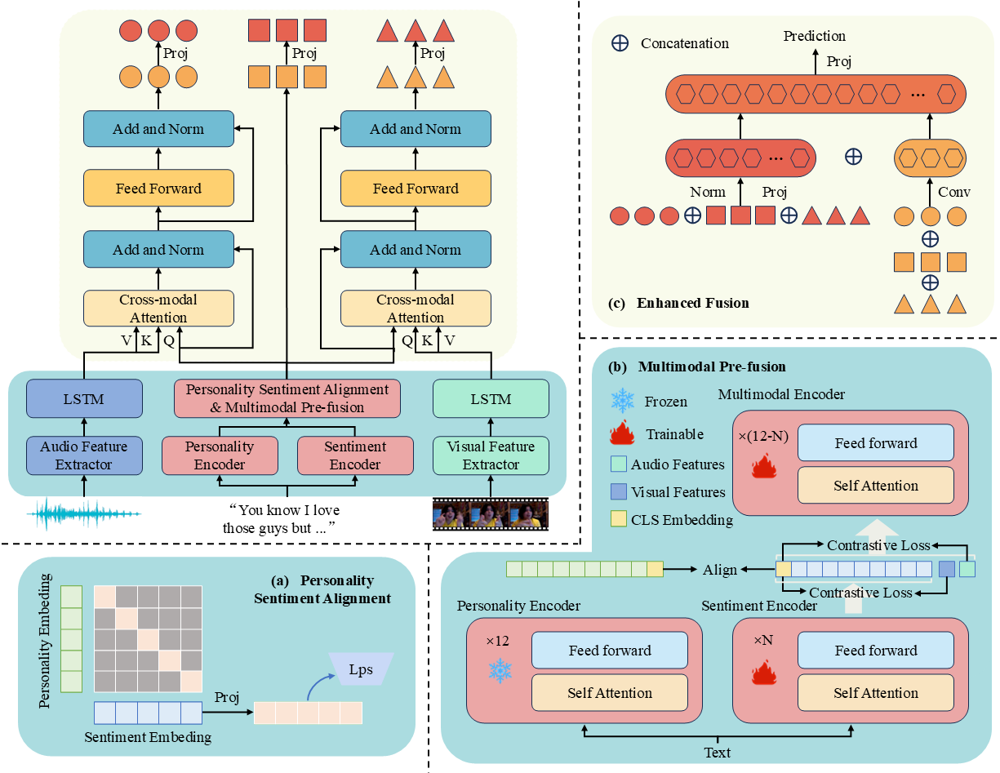

# PSA-MF: Personality-Sentiment Aligned Multi-Level Fusion for Multimodal Sentiment Analysis


This repository contains the official PyTorch implementation of the paper: **"PSA-MF: Personality-Sentiment Aligned Multi-Level Fusion for Multimodal Sentiment Analysis"**.

PSA-MF is a personality-sentiment aligned multi-level fusion framework that achieves state-of-the-art results by integrating personality traits for personalized feature extraction and employing a multi-level fusion strategy to deeply synchronize textual, visual, and audio modalities.

## 🌟 Key Features
- **Personality-Sentiment Alignment:** Novel method to inject personality traits into textual sentiment embeddings.
- **Multi-level Fusion:** A strategy to gradually integrate information from text, visual, and audio modalities.
- **SOTA Performance:** Outperforms existing baselines on MOSI and MOSEI datasets.

## 🛠️ Model Architecture


<p align="center">
  
</p>

## 📂 Project Structure

```text
PSA-MF/
├── src/
│   ├── main.py
│   ├── model.py
│   ├── config.py
│   ├── solver.py
│   ├── data_loader.py
│   ├── modules/
│   └── utils/
├── datasets/
├── train.sh
├── README.md
└── requirements.txt  
```

## 🛠️ Requirements

The code is written in Python 3.8+ and PyTorch. We recommend using Conda for environment management.

Bash

```
conda create -n psamf python=3.8
conda activate psamf
pip install -r requirements.txt
```

## 🚀 Usage

### 1. Data Preparation

Please download the CMU-MOSI and CMU-MOSEI datasets. By default, the code expects data to be in the `datasets/` folder, or you can specify the path via arguments.

### 2. Pre-trained Models

You need to specify the paths for the pre-trained BERT models in `config.py` or via command line arguments:

- `bert_path`: Path to `bert-base-uncased`
- `personality_bert_path`: Path to your pre-trained Personality BERT model.

### 3. Training

To train the model on the CMU-MOSEI dataset, you can use the provided shell script:

Bash

```
bash src/train.sh
```

## 🤝 Citation

If you find this code useful for your research, please cite our paper (**Accepted by AAAI 2026**):

```bibtex
@inproceedings{xie2026psamf,
  title={PSA-MF: Personality-Sentiment Aligned Multi-Level Fusion for Multimodal Sentiment Analysis},
  author={Xie, Heng and Zhu, Kang and Wen, Zhengqi and Tao, Jianhua and Liu, Xuefei and Fu, Ruibo and Li, Changsheng},
  booktitle={Proceedings of the AAAI Conference on Artificial Intelligence (AAAI)},
  year={2026},
  note={arXiv preprint arXiv:2512.01442}
}
```

## 📜 License

This project is open-sourced under the MIT License.